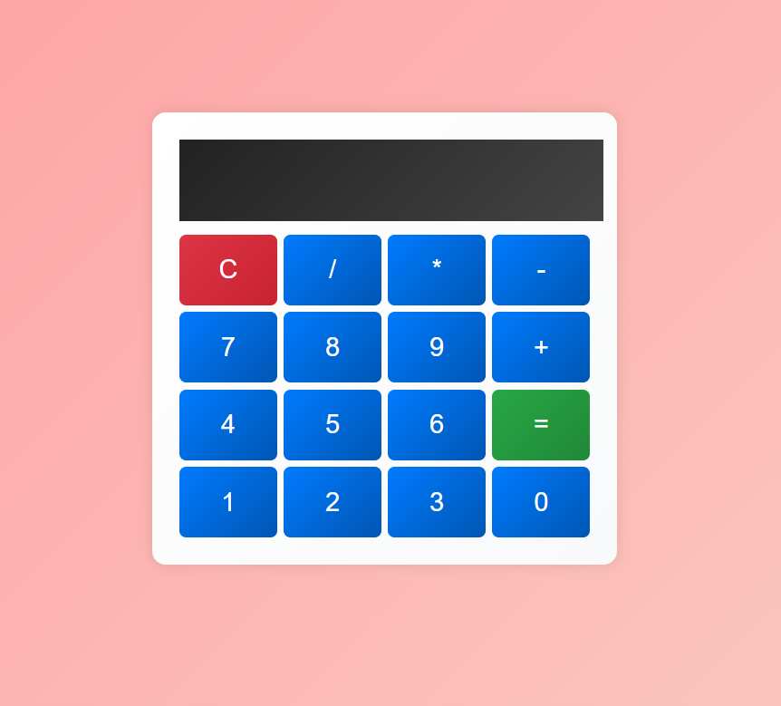

# Simple Calculator

A simple, easy-to-use calculator built using **JavaScript**, **HTML**, and **CSS**. This project demonstrates the core concepts of web development, including DOM manipulation, event handling, and responsive design.

## Features:
- Perform basic arithmetic operations: 
  - Addition
  - Subtraction
  - Multiplication
  - Division
- Clear and backspace functionalities for easy corrections
- Responsive design that works on both desktop and mobile devices
- Clean, minimalist interface

## Technologies Used:
- **HTML**: Used to structure the web page and elements
- **CSS**: Used for styling, layout, and making the calculator responsive
- **JavaScript**: Handles the calculation logic and DOM manipulation

  

